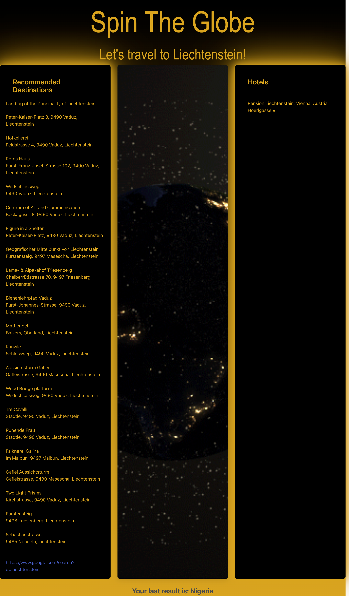

# spin-the-globe

## Description
SPIN THE GLOBE provides users a random travel destination generator, which includes the top tourist attractions and correspondig hotels. The webpage helps users pick thier next destination in case they do not know where to travel next. 

SPIN THE GLOBE solves the problem of not being able to guess where to travel next. It provides the end user a random destination if the user does not have the capability to select their next destination. 

As a group, we learned how to navigate through attained information provided by different WEB API's. We learned how to output the needed information out of the API, and extract the result of the first API into the second API. 

## Usage

When the browser opens, there are three columns displaying on the screen. The middle column is where we have our interactive element of the application. When the user clicks on the globe image displayed, they will bw given a random country at the top of the page, a list of toursit attractions on the left column, and if available, a list of hotels for them to stay at. If the user leaves the page and comes back, there will be a message displaying their last "destination", and this will update every time they click on the globe image.

## Credits

List of collaborators:

-Gevorg Avetisyan (GitHub: gevbusiness)
-Haojie Hu ( GitHub: Justinhu97)
-Joseph Moreland (GitHub: mosjoreland)
-Laura Mendez (GitHub: lim204)
-Philip Mejia (GitHub: RepoPanda)

List of Web API's:
- GeoApify: a feature-rich location platform suitable for businesses of any size used for finding destination recomended destination within the  randomly selected country.
- Hotels.com API: helped to query rooms, price, facilities, policities, etc information from many hotels around the world.

## Badges

NA

## Features

TOP TOURIST DESTINATIONS
GOOGLE SEARCH OF THE DESTINATION
HOTELS OF THE DESTINATION

